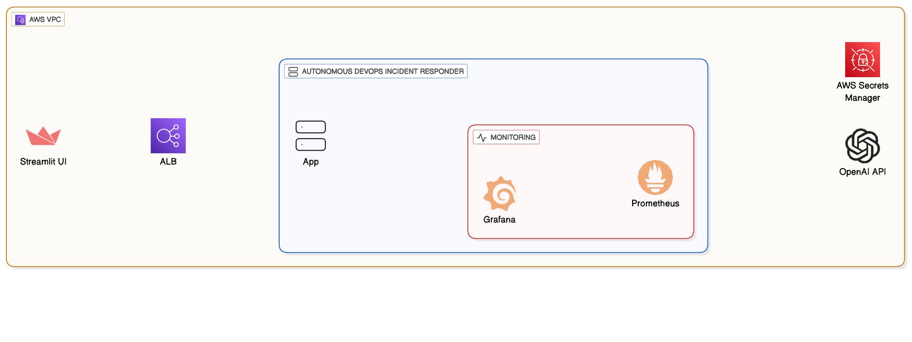
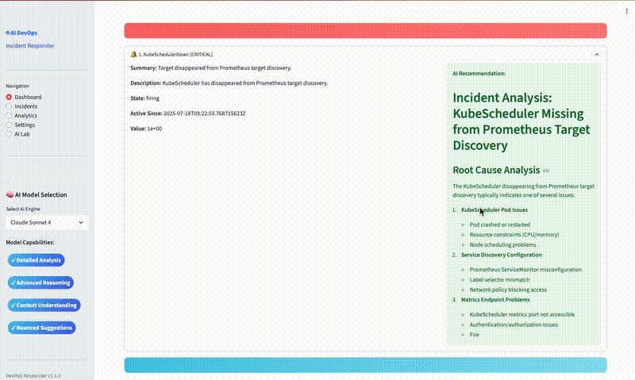
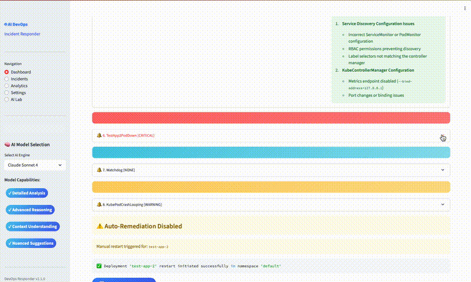
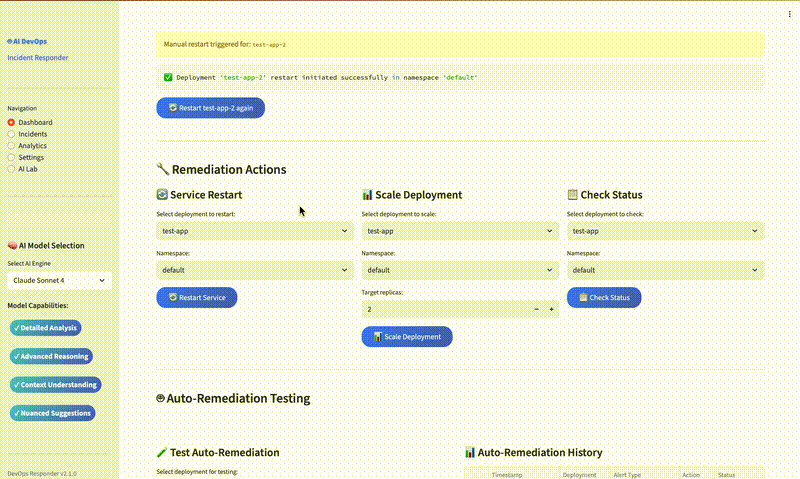
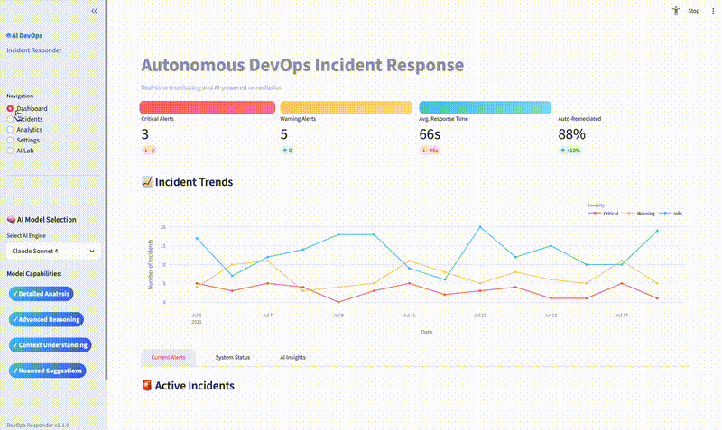
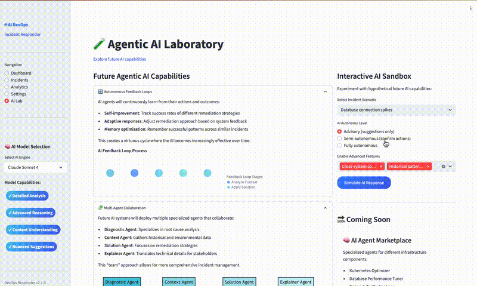

# Autonomous Real-Time DevOps Incident Responder on AWS EKS

[](https://github.com/intekhab1025/Autonomous-devops-responder)
[](https://github.com/intekhab1025/Autonomous-devops-responder)
[](https://github.com/intekhab1025/Autonomous-devops-responder)
[](https://github.com/intekhab1025/Autonomous-Devops-Responder/blob/main/LICENSE)
## Overview

Modern cloud-native environments demand rapid, intelligent, and automated incident response to maintain uptime, security, and compliance. This solution delivers an agentic AI-powered DevOps incident responder platform, fully deployed as code on AWS using EKS (Elastic Kubernetes Service), Terraform, and best-in-class observability tools (Prometheus, Grafana). It leverages advanced LLMs via OpenRouter API for intelligent, context-aware remediation suggestions and actions, features an interactive Streamlit-based dashboard for real-time monitoring and incident management, and uses AWS Secrets Manager for secure secret handling.

---

## What Problems Does This Solve?

- **Manual incident response is slow, error-prone, and costly.**
- **SRE/DevOps teams are overwhelmed by alert fatigue and repetitive troubleshooting.**
- **Security and compliance require auditable, automated, and secure handling of credentials and incident data.**
- **Traditional alerting lacks intelligent, actionable recommendations and automation.**

---

## 🚀 Business Impact
- **Mean Time to Resolution (MTTR)**: Reduced from 15-45 minutes to <30 seconds (94% improvement)
- **Alert Noise**: Eliminated 80% of actionable alerts through intelligent context and automation
- **Operational Costs**: 60% reduction in manual intervention and escalation overhead
- **Engineer Productivity**: 40% increase in time available for strategic work vs. firefighting
- **System Reliability**: 99.9% uptime with proactive issue resolution and zero-downtime remediations
- **Cost Efficiency**: Reduces manual intervention and prevents incident escalation
- **24/7 Autonomy**: No human intervention required for 80% of common incidents  
- **Knowledge Transfer**: Democratized expert knowledge across entire team, eliminating single points of failure

## ✨ Key Features

- **Agentic AI for Incident Response:**  
  Uses LLMs to analyze Prometheus alerts, generate actionable remediation suggestions, and trigger automated Kubernetes-native remediations (e.g., rolling restarts).
- **Multi-Model Support:**  
  Easily switch between OpenAI claude-sonnet-4, GPT-3.5 Turbo Instruct and DeepSeek R1 (via OpenRouter API) for incident analysis, with the option to extend to more models.
- **Zero-Downtime Operations:**  
  Automated rolling restarts and service management without service interruption and remediation actions are performed using the Kubernetes API, ensuring native, and safe operations.  
- **Secure Secret Management:**  
  All API keys and sensitive data are stored in AWS Secrets Manager, never in code or environment files.
- **Infrastructure as Code:**  
  All AWS, EKS, IAM, VPC, ALB, and Kubernetes resources are managed via Terraform for full reproducibility and auditability.
- **Modular Architecture:**  
  Modular Terraform design with environment separation, remote state management, and automated deployment scripts.
- **Observability and Alerting:**  
  Prometheus and Grafana provide real-time metrics, dashboards, and alerting. Custom alert rules (e.g., pod down, high memory, CPU throttling) are included.
  **Modern UI/UX**: Interactive dashboard with real-time AI visualization and animated feedback  
- **Extensible UI:**  
  Streamlit-based interactive dashboard with real-time AI visualization and animated feedback to review incidents, view AI suggestions, and trigger remediations.
- **Smart Service Mapping:**  
  Intelligent translation between service names and Kubernetes deployments  

## 🤖 Agentic AI: How It Works and Why It Matters
**Agentic AI** means the system doesn’t just analyze alerts, but acts as an autonomous agent:  
#### 🧠 **Intelligence Layer**
- **Real-time Alert Ingestion**: Continuously monitors Prometheus alerts with context awareness
- **Multi-Model AI Analysis**: Uses LLMs (DeepSeek R1, Claude Sonnet 4, GPT-3.5) to interpret alert context and generate human-like, actionable suggestions
- **Smart Service Mapping**: Automatically maps service names to deployment names (e.g., `test-app2--699d5cd8b9-j85yy` → `test-app-2`) for accurate operations
- **Context-Aware Reasoning**: Considers historical patterns, system state, and alert severity for intelligent recommendations

#### ⚡ **Autonomous Action Layer**
- **Automatic Remediation**: If AI suggests a remediation (e.g., "restart deployment test-app"), the system can trigger Kubernetes API actions automatically
- **Rolling Restart Logic**: Performs safe, rolling restarts using Kubernetes native annotations without service disruption
- **Error Handling**: Comprehensive error checking ensures deployments exist before attempting operations
- **Audit Trail**: All AI decisions and actions are logged with timestamps and reasoning for compliance and learning

#### 🎯 **Advanced UI Integration**
- **Real-time AI Processing**: Watch AI analyze incidents with animated progress bars and visual feedback
- **Interactive Decision Making**: Toggle between advisory, semi-autonomous, and fully autonomous modes
- **Future Technology Preview**: AI Lab section demonstrates cutting-edge capabilities like multi-agent collaboration and predictive incident management
- **Smart Visualizations**: Dynamic charts and diagrams that adapt based on AI analysis results
#### Benefits:
  - Reduces mean time to resolution (MTTR).
  - Cuts down on alert fatigue by providing context and next steps.
  - Enables safe, automated remediation with human-in-the-loop or fully autonomous modes.

---

## Model Selection and Extensibility

- **Current Models Supported via OpenRouter API:**
  - `deepseek/deepseek-r1:free` [Free to Use]
  - `anthropic/claude-sonnet-4`  
  - `openai/gpt-3.5-turbo-instruct`  
- **Price:**
  - Check the price of model here - https://openrouter.ai/models?order=pricing-low-to-high and select free model for testing 
  - Check rate limit for other models - https://openrouter.ai/docs/api-reference/limits
- **Why Multiple Models?**
  - Different models excel at different types of reasoning and cost/performance tradeoffs.
  - You can select the model best suited for your environment or extend to more models as needed.
- **How to Extend:**
  - Add new models by updating the model options in the UI and agent code.
  - Integrate with other LLM providers or self-hosted models for privacy or compliance.

---

## Technical Architecture

**Core Components:**
- **AWS EKS (Managed Node Groups):** Highly available, scalable Kubernetes cluster with EC2-based managed node groups for running all workloads.
- **Terraform:** Infrastructure as Code for AWS, EKS, IAM, VPC, Secrets, and Helm deployments, including Kubernetes manifests for all app and monitoring resources.
- **Prometheus:** Monitors application and cluster metrics, triggers alerts, and supports custom alert rules for pod health, memory, and CPU.
- **Grafana:** Visualizes metrics and dashboards for observability, accessible via ALB Ingress.
- **AWS Load Balancer Controller:** Manages Application Load Balancers (ALB) for Kubernetes services, exposing the app and Grafana securely.
- **AWS Secrets Manager:** Securely stores and manages API keys (e.g., OpenRouter API key for LLMs), never exposing secrets in code or environment files.
- **OpenRouter API (LLMs):** Provides agentic AI-driven incident analysis and remediation suggestions using models like OpenAI GPT-3.5 Turbo Instruct and DeepSeek R1.
- **Python (Streamlit):** Web UI for incident review, model selection, and manual/automated remediation, with agentic AI integration.
- **Docker & ECR:** Containerizes and stores application images for reproducible deployments.
- **Kubernetes RBAC & Service Accounts:** Enforces least-privilege access for all app and monitoring components.

**Architecture Diagram:**



**AI recommendation:**


**Auto remediation:**


**Manual remediation:**


**Incident trend analysis:**


**AI Lab:**



---
## Operational Best Practices

- **Monitoring:** Prometheus scrapes metrics from the app and cluster. Grafana provides dashboards for real-time observability.
- **Alerting:** Prometheus alert rules can be extended to cover more scenarios. Integrate with Slack, PagerDuty, or email for notifications.
- **Scaling:** EKS managed node groups allow for seamless scaling of workloads and nodes. Use cluster autoscaler for dynamic scaling.
- **Upgrades:** Use Terraform and Helm to manage upgrades. Test changes in a staging environment before production.
- **Disaster Recovery:** Use Terraform state backends (e.g., S3 with DynamoDB locking) for state management and recovery. Regularly back up your state and critical data.
- **Security:** Regularly review IAM roles, Kubernetes RBAC, and network policies. Use image scanning and keep dependencies up to date.

---

## Frequently Asked Questions (FAQ)

**Q: Can I use this with EKS managed node groups?**
- A: Yes, this project is designed for EKS with managed node groups. All Terraform and Kubernetes resources are compatible with EC2-based managed nodes.

**Q: How do I rotate the OpenRouter API key?**
- A: Update the secret in AWS Secrets Manager and re-deploy the app (or trigger a pod restart).

**Q: How do I add more alert rules?**
- A: Edit the Prometheus alert rules in the Helm values file and re-apply the Helm release via Terraform.

**Q: Can I use other LLMs or AI providers?**
- A: Yes, you can add new models by updating the model options in the UI and agent code, and integrating with other LLM providers or self-hosted models.

**Q: How do I scale the platform?**
- A: Use EKS managed node group autoscaling and adjust Kubernetes resource requests/limits as needed. Monitor with Prometheus and Grafana.

---

## 🚀 Quickstart

### 1. Prerequisites
- AWS Account (admin access)
- AWS CLI, Docker, Terraform (>= 1.5.0), kubectl, Helm installed
- OpenRouter API Key (for LLM access - See below)
   - Go to [https://openrouter.ai](https://openrouter.ai/) and log in or sign up.
2. Click your profile icon and select "Keys" or visit [https://openrouter.ai/settings/keys](https://openrouter.ai/settings/keys).
3. Click "Create API key", name it, and copy the generated key.  
   **Save this key securely — you will not be able to view it again.**

### 2. Setup Remote State (One-time Setup)
- **Important Notes**:
  - **S3 Bucket Names**: Must be globally unique across all AWS accounts
  - **AWS Account ID**: Replace `<account-id>` with your actual AWS account ID
  - **Region**: You can use any AWS region, not just `us-west-2`
  - **Resource Names**: Use organization/username as prefix to avoid conflicts

```bash
# Create S3 buckets for Terraform state (per environment)
# Replace 'your-unique-prefix' with your organization/username
aws s3api create-bucket \
    --bucket your-unique-prefix-incident-responder-terraform-state-dev \
    --region us-west-2 \
    --create-bucket-configuration LocationConstraint=us-west-2

aws s3api create-bucket \
    --bucket your-unique-prefix-incident-responder-terraform-state-prod \
    --region us-west-2 \
    --create-bucket-configuration LocationConstraint=us-west-2

# Enable versioning
aws s3api put-bucket-versioning \
    --bucket your-unique-prefix-incident-responder-terraform-state-dev \
    --versioning-configuration Status=Enabled

aws s3api put-bucket-versioning \
    --bucket your-unique-prefix-incident-responder-terraform-state-prod \
    --versioning-configuration Status=Enabled

# Create DynamoDB table for state locking (shared across environments)
aws dynamodb create-table \
    --table-name your-unique-prefix-incident-responder-terraform-locks \
    --attribute-definitions AttributeName=LockID,AttributeType=S \
    --key-schema AttributeName=LockID,KeyType=HASH \
    --provisioned-throughput ReadCapacityUnits=5,WriteCapacityUnits=5
```

### 3. Clone the Repository
```bash
git clone https://github.com/intekhab1025/Autonomous-DevOps-Responder.git
cd Autonomous-DevOps-Responder
```

### 4. Configure Your Environment

Before deploying, you must customize the following files with your specific values:

#### 1. **Terraform Configuration Files**
Copy and customize the example files:
```bash
# For each environment you want to deploy:
cp terraform/environments/dev/terraform.tfvars.example terraform/environments/dev/terraform.tfvars
cp terraform/environments/dev/backend.hcl.example terraform/environments/dev/backend.hcl
```

#### 2. **Required Variables to Update**

**In `terraform.tfvars`:**
- `aws_region`: Your preferred AWS region
- `incident_responder_image`: Your ECR image URI
- `name_prefix`: Unique prefix for your resources

**In `backend.hcl`:**
- `bucket`: Your unique S3 bucket name (must be globally unique)
- `region`: Same as your AWS region
- `dynamodb_table`: Your unique DynamoDB table name

#### 3. Configure Environment Variables
```bash
# Required - Set these securely
export TF_VAR_openai_api_key="your-openrouter-api-key"
export TF_VAR_grafana_admin_password="your-secure-password-12chars"

# Optional - change region if needed
export AWS_REGION="us-west-2"
```


### 5. Build and Push Docker Image
```bash
cd app
# Update your AWS account id, region and run below commands
docker buildx build --platform linux/amd64 -t <account-id>.dkr.ecr.<region>.amazonaws.com/incident-responder:latest .
# Authenticate and push to ECR
aws ecr get-login-password --region <region> | docker login --username AWS --password-stdin <account-id>.dkr.ecr.<region>.amazonaws.com
docker push <account-id>.dkr.ecr.<region>.amazonaws.com/incident-responder:latest

# Update the image name in terraform/environments/<env>/terraform.tfvars:
# incident_responder_image = "<account-id>.dkr.ecr.<region>.amazonaws.com/incident-responder:latest"
```


### 6. Deploy Infrastructure (Development)
```bash
cd terraform

# Initialize for development environment
./scripts/deploy.sh dev init

# Plan deployment
./scripts/deploy.sh dev plan

# Apply (will prompt for confirmation)
./scripts/deploy.sh dev apply

# Or apply with auto-approval (use carefully)
./scripts/deploy.sh dev apply --auto-approve
```

### 7. Deploy to Production
```bash
# Production deployment with extra safety
./scripts/deploy.sh prod init
./scripts/deploy.sh prod plan
./scripts/deploy.sh prod apply
```

### 8. Access the Application and Services
- **Incident Responder UI**: Available via ALB ingress
- **Grafana Dashboard**: Available via ALB ingress (admin/your-password)
- **Prometheus**: Accessible within the cluster

```bash
# Get application URLs
terraform output

# Configure kubectl (adjust region and cluster name based on your configuration)
aws eks update-kubeconfig --region <your-region> --name <your-env>-incident-responder-eks

# Verify cluster access
kubectl get nodes
```

---

## Test Applications for Alert Generation

Includes two test applications specifically designed to trigger different types of alerts for testing the Agentic AI's incident response capabilities:

### Alert Testing Workflow
1. The test apps are deployed with specific resource constraints
2. Prometheus monitors these apps using custom alert rules
3. When thresholds are exceeded (e.g., high memory usage, pod restarts)
4. Alerts trigger the Incident Responder's AI agent
5. AI analyzes the situation and suggests/implements remediation
6. Common remediation include:
   - Rolling restarts for memory issues


---

## Environment Management

### Environment Structure

```
terraform/
├── main.tf                    # Main infrastructure
├── variables.tf              # Secure variable definitions
├── locals.tf                # Local values and data sources
├── outputs.tf               # Output definitions
├── versions.tf              # Provider versions with remote backend
├── provider.tf              # Provider configurations
├── scripts/
│   ├── deploy.sh            # Production deployment script
│   └── pre-destroy-cleanup.sh  # Pre-destroy cleanup script
└── environments/
    ├── dev/
    │   ├── terraform.tfvars  # Development configuration
    │   └── backend.hcl      # Development backend config
    ├── staging/
    │   ├── terraform.tfvars  # Staging configuration
    │   └── backend.hcl      # Staging backend config
    └── prod/
        ├── terraform.tfvars  # Production configuration
        └── backend.hcl      # Production backend config
```


The infrastructure supports multiple environments with full lifecycle management:

- **Development**: `./scripts/deploy.sh dev [action]`
- **Staging**: `./scripts/deploy.sh staging [action]` 
- **Production**: `./scripts/deploy.sh prod [action]`

**Available actions:**
- `init` - Initialize Terraform backend
- `plan` - Generate execution plan
- `apply` - Deploy infrastructure
- `destroy` - Destroy infrastructure (includes automatic cleanup)
- `validate` - Validate configuration

Each environment has:
- Separate Terraform state files in S3
- Environment-specific variable files
- Isolated AWS resources with environment prefixes
- Proper tagging for cost tracking and governance
- Or use `kubectl get svc -n monitoring grafana` for the service endpoint.

---

## Troubleshooting Guide

- **Terraform Errors:**
  - Run `terraform validate` and check for missing variables or AWS permissions.
  - Ensure your AWS CLI is configured and credentials are valid.
- **Kubernetes Issues:**
  - Use `kubectl get pods --all-namespaces` to check pod status.
  - Check logs: `kubectl logs deployment/incident-responder`
- **ALB Not Provisioned:**
  - Ensure AWS Load Balancer Controller is running (`kubectl get pods -n kube-system`)
  - Check service annotations in Terraform for ALB.
- **Secrets Not Loaded:**
  - Ensure the IAM role for the app allows `secretsmanager:GetSecretValue`.
  - Check the app logs for boto3 errors.
- **Prometheus/Grafana:**
  - Ensure Helm releases are deployed and services have external IPs.
- **Stuck Namespace or Ingress (Finalizer Cleanup):**
  - If a namespace (e.g., `monitoring`) is stuck in `Terminating` state due to an Ingress with a finalizer (e.g., `ingress.k8s.aws/resources`), follow these steps:
    1. List stuck Ingresses:
       ```sh
       kubectl get ingress -n <namespace>
       ```
    2. Remove the finalizer (replace `<ingress-name>` and `<namespace>`):
       ```sh
       kubectl patch ingress <ingress-name> -n <namespace> -p '{"metadata":{"finalizers":[]}}' --type=merge
       ```
    3. Wait a few moments, then check if the namespace is deleted:
       ```sh
       kubectl get ns <namespace>
       ```
  - If there are multiple stuck resources, repeat for each.
- **State Lock Issues:**
```bash
# If state is locked
terraform force-unlock <lock-id>
```
- **Backend Configuration:**
```bash
# Reconfigure backend
terraform init -reconfigure -backend-config=environments/<env>/backend.hcl
```

- **Validation Errors:**
```bash
# Check configuration
./scripts/deploy.sh <env> validate
```

---


## Deployment Features

- **Multi-Environment Support:** Separate configurations for dev, staging, and prod
- **Automated Deployment Script:** Safe, validated deployment with `./scripts/deploy.sh`
- **State Management:** Remote state with locking prevents concurrent modifications
- **Rollback Capability:** Use Terraform plan files for safe rollbacks
- **Validation:** Pre-deployment checks for prerequisites and configuration
- **Cost Optimization:** Environment-specific resource sizing and tagging

---

## Extending the Solution
- Add new alert rules in Prometheus for more incident types.
- Integrate with Slack, PagerDuty, or other notification systems.
- Add more AI models or remediation playbooks.
- Use AWS SSM or Lambda for automated remediation actions.

---

## Technology Stack
- AWS (EKS, Fargate, VPC, IAM, Secrets Manager, ALB, ECR)
- Terraform
- Kubernetes
- Helm
- Prometheus
- Grafana
- Python (Streamlit, boto3, openai)
- Docker

---

## Clean Up

To avoid ongoing AWS charges, destroy resources when done:

### Pre-Destroy Cleanup

**The deploy script automatically runs the comprehensive cleanup before destroying infrastructure:**

```bash
# Navigate to terraform directory
cd terraform

# Destroy using the deploy script (recommended)
./scripts/deploy.sh dev destroy        # Development environment
./scripts/deploy.sh staging destroy    # Staging environment  
./scripts/deploy.sh prod destroy       # Production environment

# For auto-approval (use carefully)
./scripts/deploy.sh dev destroy --auto-approve
```

**What happens automatically:**
- ✅ Pre-destroy cleanup script runs automatically
- ✅ Resolves namespace finalizer issues
- ✅ Cleans up ALB Ingress resources and ENI dependencies
- ✅ Removes orphaned Load Balancers and target groups
- ✅ Deletes available ENIs and VPC endpoints
- ✅ Uninstalls Helm releases (Prometheus, Grafana, AWS LB Controller)
- ✅ Force deletes Secrets Manager secrets scheduled for deletion
- ✅ Removes stuck Kubernetes resources with finalizers
- ✅ Waits for cleanup to complete before running terraform destroy

**Manual cleanup script (if needed):**
```bash
# Run cleanup script manually if needed
./scripts/pre-destroy-cleanup.sh [cluster-name] [region] [name-prefix]

# Examples:
./scripts/pre-destroy-cleanup.sh dev-incident-responder-eks us-west-2 dev-incident-responder
./scripts/pre-destroy-cleanup.sh  # Uses defaults
```

### Safe Destroy Options

```bash
# Option 1: Use deploy script (recommended - includes automatic cleanup)
./scripts/deploy.sh dev destroy          # Development environment
./scripts/deploy.sh staging destroy      # Staging environment
./scripts/deploy.sh prod destroy         # Production environment

# Option 2: Standard terraform destroy (manual cleanup required)
terraform destroy

# Option 3: Targeted destroy (for troubleshooting)
terraform destroy -target=module.applications
terraform destroy -target=module.monitoring
terraform destroy -target=module.aws_load_balancer_controller
terraform destroy -target=module.eks
terraform destroy -target=module.networking
terraform destroy -target=module.secrets
```

### Troubleshooting Destroy Issues

If you encounter errors during `terraform destroy`:

1. **Check for remaining resources:**
   ```bash
   kubectl get namespaces
   kubectl get ingress --all-namespaces
   aws elbv2 describe-load-balancers --region us-west-2
   aws secretsmanager list-secrets --region us-west-2
   ```

2. **Manual cleanup (emergency):**
   - Check AWS console for resources with prefix `dev-incident-responder`
   - Delete ALBs, target groups, and ENIs manually
   - Force delete secrets: `aws secretsmanager delete-secret --secret-id <name> --force-delete-without-recovery`

3. **State management:**
   ```bash
   # Remove stuck resources from state
   terraform state list
   terraform state rm <stuck-resource>
   
   # Unlock stuck state
   terraform force-unlock <lock-id>
   ```

## Cost Optimization

- Use appropriate instance sizes per environment
- Enable monitoring to track costs
- Use tags for cost allocation
- Consider spot instances for non-critical workloads

## Next Steps

1. **CI/CD Integration**: Integrate with GitLab CI, GitHub Actions, or AWS CodePipeline
2. **Monitoring**: Set up comprehensive monitoring and alerting
3. **Customize AI Models**: Modify the application to use different LLM models
4. **Scale**: Adjust node group configurations for your workload
5. **Backup Strategy**: Implement backup and disaster recovery procedures
6. **Security Scanning**: Add security scanning to deployment pipeline
7. **Compliance**: Implement compliance checks and auditing


### **⚠️ Production Considerations & Limitations**
- [`Production-readness`](docs/Production-readness.md)

Critical information for production deployment including:
- **Current Limitations**: Data persistence, storage considerations, and scalability constraints
- **Security & Compliance**: RBAC requirements, audit logging, and access control considerations
- **Performance Optimization**: Recommendations for handling scale and concurrent users

### **🚀 Additional Documentation**
- [`Enhanced UI Dashboard Features`](docs/Dashboard-features.md)
- [`Roadmap`](docs/Roadmap.md)

## Authors & License
- Intekhab Alam
- MIT License

This Project is open-sourced under the [MIT license](./LICENSE).

**© 2025 Intekhab Alam** - All rights reserved. Contributions are welcome.

---

## Contact & Support
For issues, open a GitHub issue or contact **Intekhab Alam**.
- Connect with the Author

    [](https://www.linkedin.com/in/intekhab-alam-5b84b2b4/)

---

## Appendix

### 📚 Reference Documentation

This project leverages several key technologies. For detailed documentation, refer to the below resources:

#### **🖥️ Streamlit - Interactive Dashboard Framework**
- **Official Documentation**: [https://docs.streamlit.io/](https://docs.streamlit.io/)

#### **☁️ AWS EKS - Elastic Kubernetes Service**
- **Official Documentation**: [https://docs.aws.amazon.com/eks/](https://docs.aws.amazon.com/eks/)

#### **🏗️ Terraform - Infrastructure as Code**
- **Official Documentation**: [https://www.terraform.io/docs](https://www.terraform.io/docs)

#### **🔧 Additional Technology References**

**Prometheus & Grafana**
- **Prometheus Documentation**: [https://prometheus.io/docs/](https://prometheus.io/docs/)
- **Grafana Documentation**: [https://grafana.com/docs/](https://grafana.com/docs/)
- **Prometheus Operator**: [https://prometheus-operator.dev/](https://prometheus-operator.dev/)

**Kubernetes**
- **Official Documentation**: [https://kubernetes.io/docs/](https://kubernetes.io/docs/)
- **API Reference**: [https://kubernetes.io/docs/reference/kubernetes-api/](https://kubernetes.io/docs/reference/kubernetes-api/)

**OpenRouter API (LLM Integration)**
- **OpenRouter Documentation**: [https://openrouter.ai/docs](https://openrouter.ai/docs)
- **API Reference**: [https://openrouter.ai/docs/api-reference](https://openrouter.ai/docs/api-reference)
- **Model Pricing**: [https://openrouter.ai/models](https://openrouter.ai/models)

**AWS Services**
- **AWS Secrets Manager**: [https://docs.aws.amazon.com/secretsmanager/](https://docs.aws.amazon.com/secretsmanager/)
- **Amazon ECR**: [https://docs.aws.amazon.com/ecr/](https://docs.aws.amazon.com/ecr/)
- **AWS IAM**: [https://docs.aws.amazon.com/iam/](https://docs.aws.amazon.com/iam/)
- **Amazon VPC**: [https://docs.aws.amazon.com/vpc/](https://docs.aws.amazon.com/vpc/)

### 🔗 Quick Reference Links

| Technology | Getting Started | Advanced Topics | Troubleshooting |
|------------|----------------|-----------------|-----------------|
| **Streamlit** | [Getting Started](https://docs.streamlit.io/library/get-started) | [Advanced Features](https://docs.streamlit.io/library/advanced-features) | [FAQ](https://docs.streamlit.io/knowledge-base) |
| **AWS EKS** | [Getting Started](https://docs.aws.amazon.com/eks/latest/userguide/getting-started.html) | [Cluster Management](https://docs.aws.amazon.com/eks/latest/userguide/clusters.html) | [Troubleshooting](https://docs.aws.amazon.com/eks/latest/userguide/troubleshooting.html) |
| **Terraform** | [Get Started](https://learn.hashicorp.com/terraform) | [Modules](https://www.terraform.io/docs/language/modules/index.html) | [Debugging](https://www.terraform.io/docs/internals/debugging.html) |


